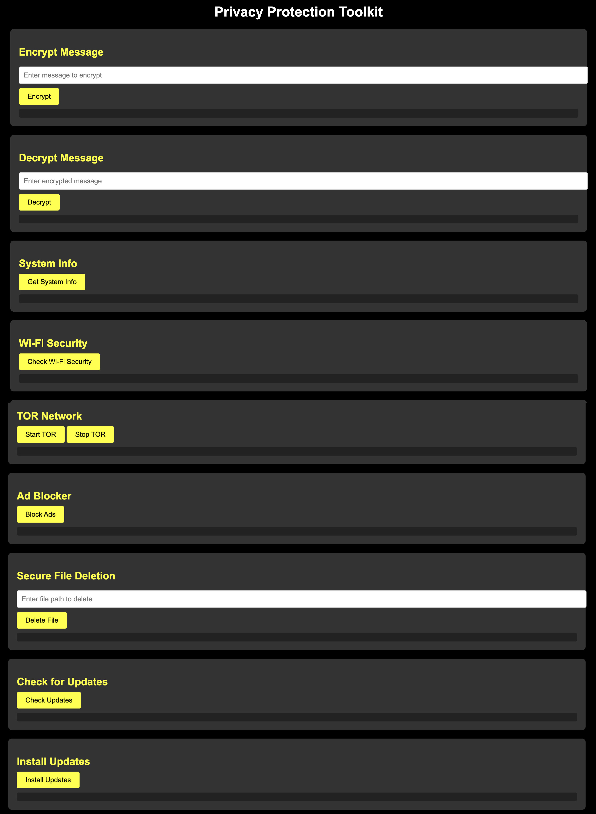

# Privacy Protection Toolkit

## Introduction
The Privacy Protection Toolkit is a comprehensive tool designed to enhance your digital privacy and security. It provides functionalities like encryption and decryption, Wi-Fi security checks, TOR network integration, ad blocking, secure file deletion, and system information display. The toolkit is user-friendly, reliable, and compatible with all major operating systems (Windows, macOS, Linux).

##

##

## Features
- **Encryption & Decryption**: Secure your messages with advanced encryption.
- **Wi-Fi Security Checker**: Ensures your Wi-Fi connection uses WPA2 or WPA3 security protocols.
- **TOR Network Integration**: Browse anonymously using the TOR network.
- **Ad Blocker**: Blocks intrusive ads for a cleaner browsing experience.
- **Secure File Deletion**: Permanently delete files to prevent recovery.
- **System Information**: Displays detailed system information.
- **Cross-Platform**: Works seamlessly on Windows, macOS, and Linux.
- **User-Friendly**: Simple and intuitive interface.
- **Reliable**: Ensures consistent performance and security.

## Installation

### Prerequisites
- Python 3.8+
- Flask
- Neofetch (installed on your system)

### Steps
1. Clone the repository:
    ```sh
    git clone https://github.com/Rishikesh-khot/Privacy-Protection-Toolkit.git
    cd Privacy-Protection-Toolkit
    ```

2. Create and activate a virtual environment:
    ```sh
    python -m venv venv
    source venv/bin/activate  # On Windows, use `venv\Scripts\activate`
    ```

3. Install the required packages:
    ```sh
    pip install -r requirements.txt
    ```

4. Run the server:
    ```sh
    python server.py
    ```

5. Open your browser and go to `http://127.0.0.1:5000`

## Usage
Detailed usage instructions can be found in the [docs/usage.md](docs/usage.md) file.

## Results
The toolkit provides a user-friendly web interface with a variety of tools to enhance your privacy and security. Below is a screenshot of the main interface:


## Contributing
Contributions are welcome! Please read the [CONTRIBUTING.md](CONTRIBUTING.md) for guidelines.

## License
This project is licensed under the MIT License - see the [LICENSE](LICENSE) file for details.

## Acknowledgments
- Flask for the web framework
- Neofetch for system information
- Rishikesh Khot for developing this toolkit
